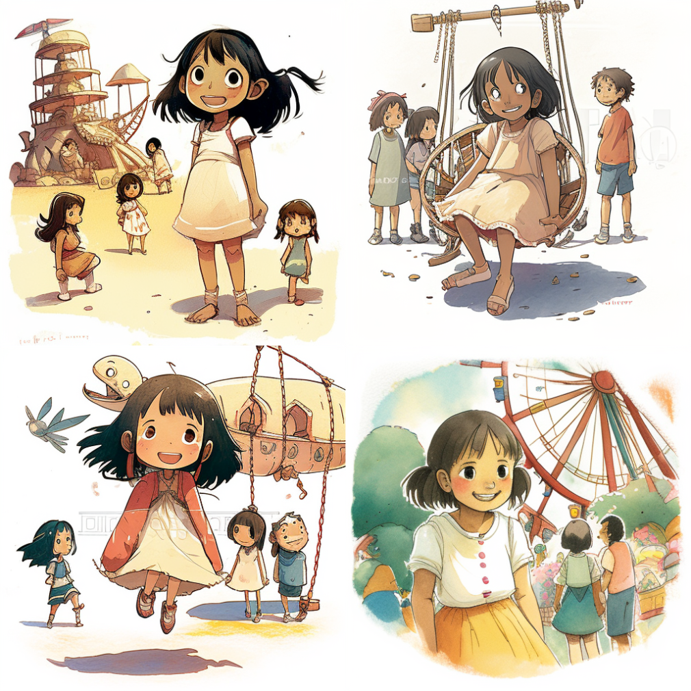
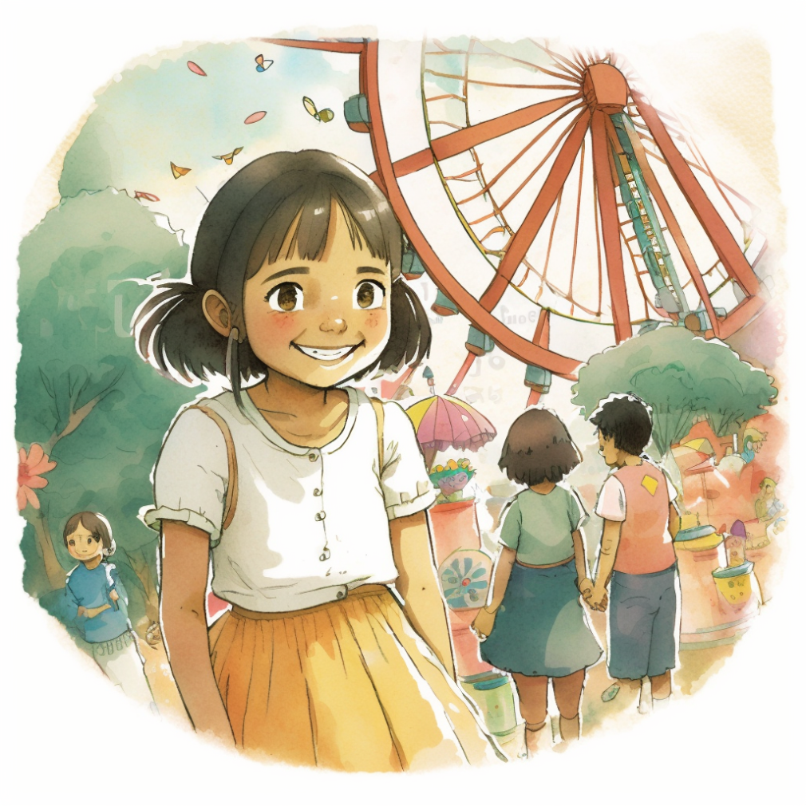
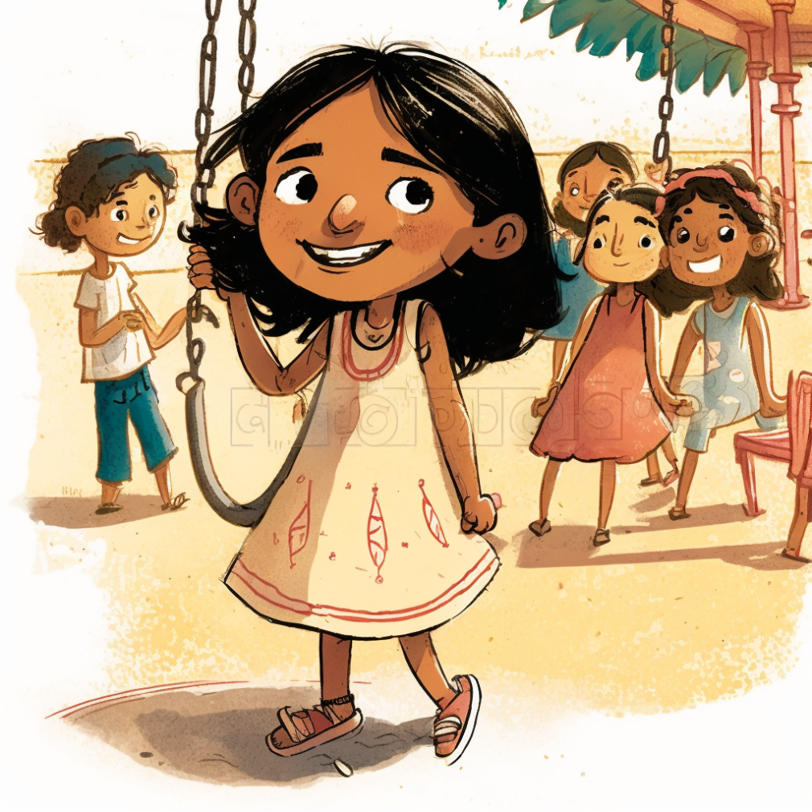
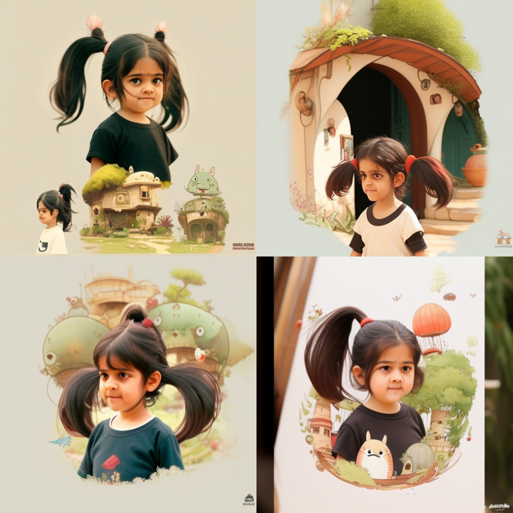
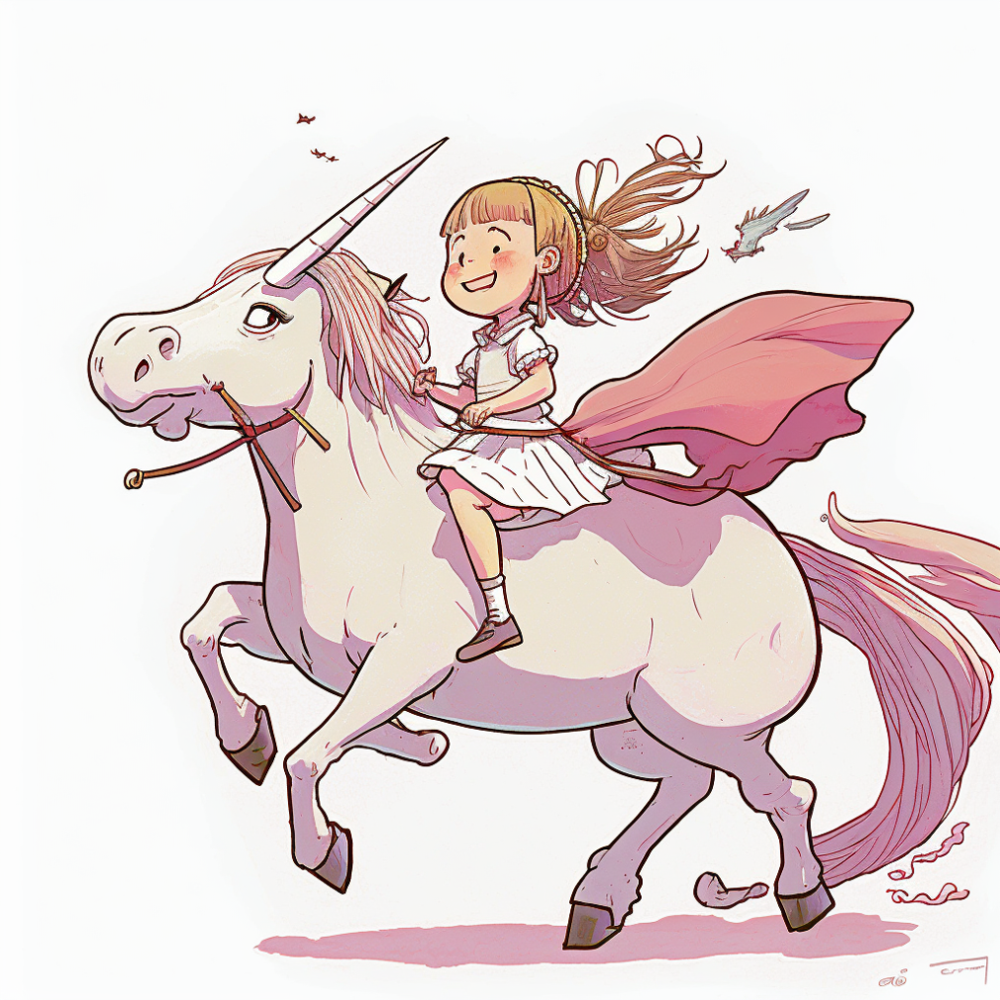
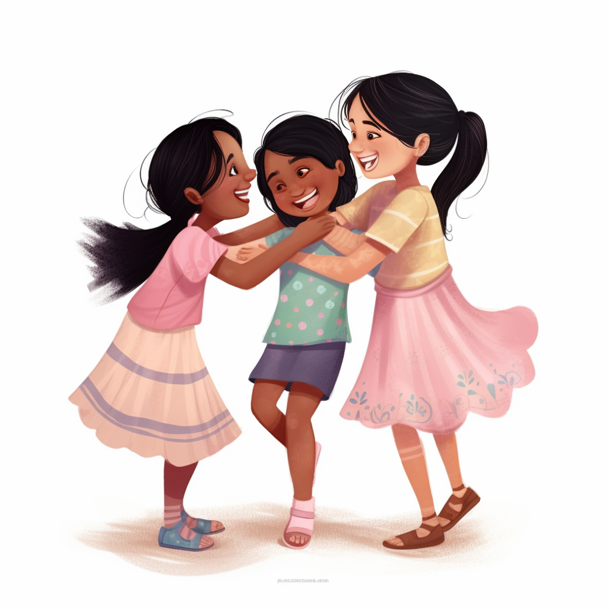
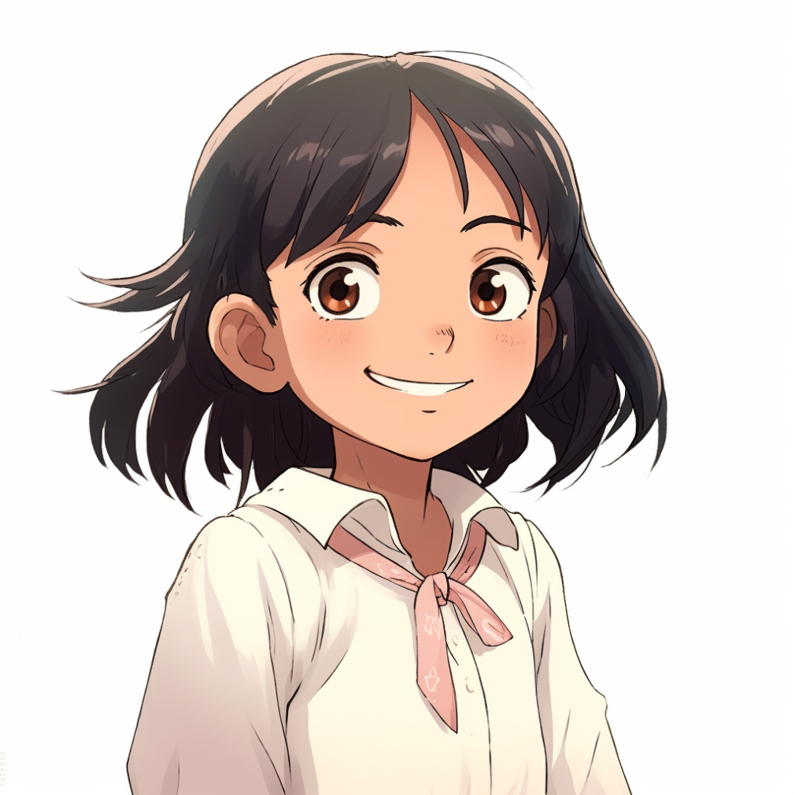
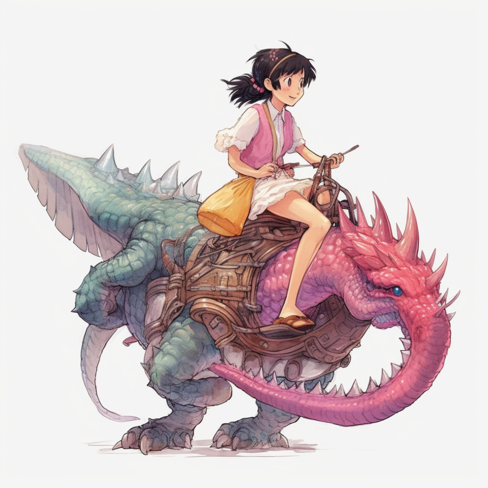
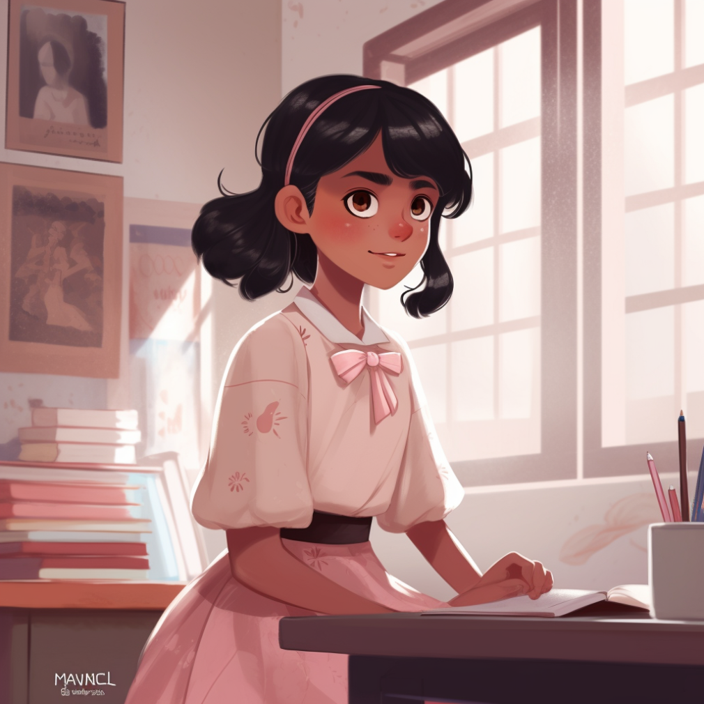

I wanted to gift something special to my niece for her 9th birthday earlier this month. At the same time, I was exploring the possibilities with the new AI tools coming up each day. I decided to write a storybook where she would be the main character, with the help of chatGPT. It would also have some images generated using Midjourney to make it special and be printed and delivered to her.

### The story

I submitted the following prompt to chatGPT to start 

```
Zitin is going to turn 9 soon. 
Let's write an Encanto-style storybook for her that can be printed and gifted on her birthday.
The book will have 5 chapters of 1000 words each. She likes painting, lego, unicorns, making jokes, and playing with friends. 
She is thin and has black hair and speaks Hindi.
We will write one chapter at a time, I will ask for changes and once final,
I will ask you to write the next chapter.
```


This provided a good starting point, and chatGPT would start building a story right away. Most of the ideas were simple and similar to some existing storybooks, nothing out of the ordinary. I finally settled on one of the ideas and wrote a few chapters. It would sometimes include violence or things not suited for her age, but prompting it would change the storyline. 

Finally, I had a story where she has a magic pencil, and anything she draws comes to life. Not the most original idea, but works for me.

### The images

For generating the images, I used [Midjourney](https://www.midjourney.com/). 

TL;DR: Prompts on Midjourney are very different from chatGPT. It takes some time to understand. The open channels are a great way to learn how to write a good prompt without wasting any time and money.

I started with simple prompts like:
`<photo url> Disney style cartoon from this face, pop art` 
and  
`madrigal from Encanto, making a pencil drawing of a tree, pop art, 16:9 `

These were absolute disasters. 

A few attempts and internet searches later, I got to something decent like 

```
a happy 9 year old Indian girl in a playground with friends,
children’s storybook, illustration, studio ghibli, Encanto, Disney,
on a white background
```

The output of these were amazing, except for some strange watermarks. 



Soon I was presented with a major challenge. **The character in each of the images looks different**, which in the hindsight is very obvious given how ML works. I tried a few ways to go around this limitation.

| ------------- | ------------- |
|  | |

Firstly, **uploading an image** of her face and including it in the prompt. The outputs were horrible and I dropped the idea of including the photos in the prompt.



Next, I tried to see if adding a **[seed number](https://docs.midjourney.com/docs/seeds)** for the job would make things any better, but no luck there.

Lastly, I thought if I can put a **celebrity name** in the prompt, it might make the character look similar in all the photos, and what better option than a 9 year old Emma Watson? but still no luck. 

Another tool that looked promising was [Fusion Brain](https://fusionbrain.ai/en/diffusion) with options to add specific styles. 

### The output

Finally, I had to settle with sending a card built using one of the images generated by Midjourney, edited using [Canva's magic design tool](https://www.canva.com/magic-design/).




### and more

Here is a select set of images generated in the process that I found worth publishing.


| ------------- | ------------- |
|  |   |
| |  |